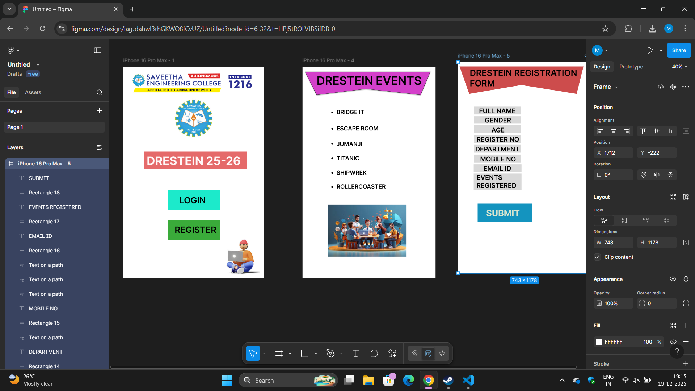

# Ex08 Event Registration Web Application
## Date: 19-12-2025

## AIM:
To design, develop and deploy a web application for event registration using Figma UI tool.

## UI DESIGN TOOL:
Figma

## DESIGN STEPS:

### Step 1:
Use frames to represent screens or sections.

### Step 2:
Add column grids for consistent spacing and alignment.

### Step 3:
Insert shapes, text, buttons, and icons.

### Step 4:
Use Auto Layout for flexible, responsive design.

### Step 5:
Define color, text, and effect styles globally for consistency.

### Step 6:
Name layers logically and group related elements.

### Step 6:
Link frames to show navigation or interactions.

### Step 7:
Select the specific frame while generating code using Anima plugin.

## CODE:
```
Page 1

.iphone-pro-max {
  background-color: #ffffff;
  width: 100%;
  min-width: 787px;
  min-height: 1178px;
  position: relative;
}

.iphone-pro-max .image {
  top: 17px;
  left: 27px;
  width: 720px;
  height: 144px;
  aspect-ratio: 5.01;
  position: absolute;
  object-fit: cover;
}

.iphone-pro-max .img {
  top: 178px;
  left: 279px;
  width: 229px;
  height: 220px;
  aspect-ratio: 1.04;
  position: absolute;
  object-fit: cover;
}

.iphone-pro-max .text-on-a-path {
  position: absolute;
  top: 699px;
  left: 319px;
  width: 451px;
  height: 139px;
}

.iphone-pro-max .rectangle {
  position: absolute;
  top: 473px;
  left: 116px;
  width: 576px;
  height: 97px;
}

.iphone-pro-max .text-wrapper {
  position: absolute;
  top: 486px;
  left: 131px;
  width: 616px;
  font-family: "Inter-Bold", Helvetica;
  font-weight: 700;
  color: #fff8f8;
  font-size: 64px;
  letter-spacing: 0;
  line-height: normal;
}

.iphone-pro-max .div {
  position: absolute;
  top: 690px;
  left: 248px;
  width: 292px;
  height: 111px;
  background-color: #1beacb;
}

.iphone-pro-max .text-wrapper-2 {
  position: absolute;
  top: 717px;
  left: 313px;
  font-family: "Inter-SemiBold", Helvetica;
  font-weight: 600;
  color: #000000;
  font-size: 48px;
  letter-spacing: 0;
  line-height: normal;
}

.iphone-pro-max .rectangle-2 {
  position: absolute;
  top: 855px;
  left: 248px;
  width: 292px;
  height: 113px;
  background-color: #39aa39;
}

.iphone-pro-max .text-wrapper-3 {
  position: absolute;
  top: 881px;
  left: 287px;
  font-family: "Inter-SemiBold", Helvetica;
  font-weight: 600;
  color: #000000;
  font-size: 48px;
  letter-spacing: 0;
  line-height: normal;
}

.iphone-pro-max .image-2 {
  top: 939px;
  left: 540px;
  width: 225px;
  height: 225px;
  aspect-ratio: 1;
  position: absolute;
  object-fit: cover;
}

Page 2

.iphone-pro-max {
  background-color: #ffffff;
  width: 100%;
  min-width: 743px;
  min-height: 1178px;
  position: relative;
}

.iphone-pro-max .rectangle {
  position: absolute;
  top: 27px;
  left: 10px;
  width: 710px;
  height: 138px;
}

.iphone-pro-max .text-wrapper {
  position: absolute;
  top: 38px;
  left: 79px;
  font-family: "Inter-SemiBold", Helvetica;
  font-weight: 600;
  color: #000000;
  font-size: 64px;
  letter-spacing: 0;
  line-height: normal;
}

.iphone-pro-max .div {
  position: absolute;
  top: 233px;
  left: 142px;
  font-family: "Inter-SemiBold", Helvetica;
  font-weight: 600;
  color: #000000;
  font-size: 32px;
  letter-spacing: 0;
  line-height: normal;
}

.iphone-pro-max .text-wrapper-2 {
  position: absolute;
  top: 324px;
  left: 142px;
  font-family: "Inter-SemiBold", Helvetica;
  font-weight: 600;
  color: #000000;
  font-size: 32px;
  letter-spacing: 0;
  line-height: normal;
}

.iphone-pro-max .text {
  position: absolute;
  top: 408px;
  left: 142px;
  font-family: "Inter-SemiBold", Helvetica;
  font-weight: 600;
  color: #000000;
  font-size: 32px;
  letter-spacing: 0;
  line-height: normal;
}

.iphone-pro-max .text-wrapper-3 {
  position: absolute;
  top: 411px;
  left: 190px;
  font-family: "Inter-SemiBold", Helvetica;
  font-weight: 600;
  color: #000000;
  font-size: 32px;
  letter-spacing: 0;
  line-height: normal;
}

.iphone-pro-max .text-2 {
  top: 490px;
  position: absolute;
  left: 142px;
  font-family: "Inter-SemiBold", Helvetica;
  font-weight: 600;
  color: #000000;
  font-size: 32px;
  letter-spacing: 0;
  line-height: normal;
}

.iphone-pro-max .text-wrapper-4 {
  position: absolute;
  top: 491px;
  left: 190px;
  font-family: "Inter-SemiBold", Helvetica;
  font-weight: 600;
  color: #000000;
  font-size: 32px;
  letter-spacing: 0;
  line-height: normal;
}

.iphone-pro-max .text-3 {
  top: 571px;
  width: 48px;
  white-space: nowrap;
  position: absolute;
  left: 142px;
  font-family: "Inter-SemiBold", Helvetica;
  font-weight: 600;
  color: #000000;
  font-size: 32px;
  letter-spacing: 0;
  line-height: normal;
}

.iphone-pro-max .text-wrapper-5 {
  position: absolute;
  top: 571px;
  left: 190px;
  font-family: "Inter-SemiBold", Helvetica;
  font-weight: 600;
  color: #000000;
  font-size: 32px;
  letter-spacing: 0;
  line-height: normal;
}

.iphone-pro-max .text-wrapper-6 {
  position: absolute;
  top: 649px;
  left: 142px;
  font-family: "Inter-SemiBold", Helvetica;
  font-weight: 600;
  color: #000000;
  font-size: 32px;
  letter-spacing: 0;
  line-height: normal;
}

.iphone-pro-max .image {
  position: absolute;
  top: 769px;
  left: 142px;
  width: 437px;
  height: 291px;
  aspect-ratio: 1.5;
  object-fit: cover;
}

Page 3

.iphone-pro-max {
  background-color: #ffffff;
  overflow: hidden;
  width: 100%;
  min-width: 743px;
  min-height: 1178px;
  position: relative;
}

.iphone-pro-max .rectangle {
  position: absolute;
  top: 24px;
  left: 8px;
  width: 692px;
  height: 153px;
}

.iphone-pro-max .text-wrapper {
  position: absolute;
  top: 31px;
  left: 65px;
  width: 700px;
  font-family: "Inter-SemiBold", Helvetica;
  font-weight: 600;
  color: #000000;
  font-size: 48px;
  letter-spacing: 0;
  line-height: normal;
}

.iphone-pro-max .text-on-a-path {
  position: absolute;
  top: 459px;
  left: -1639px;
  width: 410px;
  height: 90px;
}

.iphone-pro-max .div {
  position: absolute;
  top: 248px;
  left: 89px;
  width: 262px;
  height: 44px;
  background-color: #d9d9d9;
}

.iphone-pro-max .text-wrapper-2 {
  position: absolute;
  top: 250px;
  left: 117px;
  font-family: "Inter-SemiBold", Helvetica;
  font-weight: 600;
  color: #000000;
  font-size: 36px;
  letter-spacing: 0;
  line-height: normal;
}

.iphone-pro-max .img {
  position: absolute;
  top: 559px;
  left: -1612px;
  width: 254px;
  height: 42px;
}

.iphone-pro-max .text-on-a-path-2 {
  position: absolute;
  top: 559px;
  left: -1620px;
  width: 262px;
  height: 42px;
}

.iphone-pro-max .text-on-a-path-3 {
  position: absolute;
  top: 549px;
  left: -1620px;
  width: 262px;
  height: 41px;
}

.iphone-pro-max .rectangle-2 {
  position: absolute;
  top: 302px;
  left: 89px;
  width: 262px;
  height: 41px;
  background-color: #d9d9d9;
}

.iphone-pro-max .text-wrapper-3 {
  position: absolute;
  top: 302px;
  left: 149px;
  font-family: "Inter-SemiBold", Helvetica;
  font-weight: 600;
  color: #000000;
  font-size: 36px;
  letter-spacing: 0;
  line-height: normal;
}

.iphone-pro-max .rectangle-3 {
  position: absolute;
  top: 351px;
  left: 89px;
  width: 262px;
  height: 44px;
}

.iphone-pro-max .text-wrapper-4 {
  position: absolute;
  top: 357px;
  left: 186px;
  font-family: "Inter-SemiBold", Helvetica;
  font-weight: 600;
  color: #000000;
  font-size: 36px;
  letter-spacing: 0;
  line-height: normal;
}

.iphone-pro-max .rectangle-4 {
  position: absolute;
  top: 408px;
  left: 89px;
  width: 262px;
  height: 44px;
}

.iphone-pro-max .text-wrapper-5 {
  position: absolute;
  top: 409px;
  left: 103px;
  font-family: "Inter-SemiBold", Helvetica;
  font-weight: 600;
  color: #000000;
  font-size: 36px;
  letter-spacing: 0;
  line-height: normal;
}

.iphone-pro-max .text-on-a-path-4 {
  position: absolute;
  top: 689px;
  left: -1620px;
  width: 262px;
  height: 44px;
}

.iphone-pro-max .rectangle-5 {
  position: absolute;
  top: 461px;
  left: 89px;
  width: 262px;
  height: 44px;
  background-color: #d9d9d9;
}

.iphone-pro-max .text-wrapper-6 {
  position: absolute;
  top: 463px;
  left: 96px;
  width: 247px;
  font-family: "Inter-SemiBold", Helvetica;
  font-weight: 600;
  color: #000000;
  font-size: 36px;
  letter-spacing: 0;
  line-height: normal;
  white-space: nowrap;
}

.iphone-pro-max .text-on-a-path-5 {
  position: absolute;
  top: 700px;
  left: -1623px;
  width: 262px;
  height: 44px;
}

.iphone-pro-max .rectangle-6 {
  position: absolute;
  top: 516px;
  left: 89px;
  width: 262px;
  height: 44px;
}

.iphone-pro-max .text-wrapper-7 {
  position: absolute;
  top: 519px;
  left: 123px;
  transform: rotate(0.15deg);
  font-family: "Inter-SemiBold", Helvetica;
  font-weight: 600;
  color: #000000;
  font-size: 36px;
  letter-spacing: 0;
  line-height: normal;
}

.iphone-pro-max .text-on-a-path-6 {
  position: absolute;
  top: 801px;
  left: -1620px;
  width: 262px;
  height: 43px;
}

.iphone-pro-max .text-on-a-path-7 {
  position: absolute;
  top: 799px;
  left: -1620px;
  width: 262px;
  height: 45px;
}

.iphone-pro-max .text-on-a-path-8 {
  position: absolute;
  top: 791px;
  left: -1625px;
  width: 265px;
  height: 45px;
}

.iphone-pro-max .rectangle-7 {
  position: absolute;
  top: 571px;
  left: 87px;
  width: 267px;
  height: 43px;
  background-color: #d9d9d9;
}

.iphone-pro-max .text-wrapper-8 {
  position: absolute;
  top: 571px;
  left: 141px;
  font-family: "Inter-SemiBold", Helvetica;
  font-weight: 600;
  color: #000000;
  font-size: 36px;
  letter-spacing: 0;
  line-height: normal;
}

.iphone-pro-max .rectangle-8 {
  position: absolute;
  top: 622px;
  left: 87px;
  width: 267px;
  height: 92px;
  background-color: #d9d9d9;
}

.iphone-pro-max .text-wrapper-9 {
  position: absolute;
  top: 622px;
  left: 103px;
  width: 251px;
  font-family: "Inter-SemiBold", Helvetica;
  font-weight: 600;
  color: #000000;
  font-size: 36px;
  letter-spacing: 0;
  line-height: normal;
}

.iphone-pro-max .rectangle-9 {
  position: absolute;
  top: 790px;
  left: 109px;
  width: 303px;
  height: 104px;
  background-color: #1394bf;
}

.iphone-pro-max .text-wrapper-10 {
  position: absolute;
  top: 814px;
  left: 157px;
  font-family: "Inter-Bold", Helvetica;
  font-weight: 700;
  color: #d9e5ce;
  font-size: 48px;
  letter-spacing: 0;
  line-height: normal;
}
```

## OUTPUT:


## RESULT:
The program to design, develop and deploy a web application for event registration using Figma UI tool is completed successfully.
